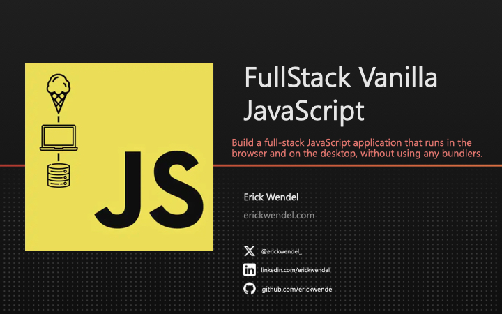

# Fullstack Vanilla JavaScript


## Abstract Factory

```
.
├── src
│   ├── platforms
│   │   ├── console
│   │   │   └── view.js
│   │   └── web
│   │       └── view.js
│   └── shared
│       └── viewBase.js
└── ui
    └── index.html
```

platforms/ - Platform-Specific Implementations: You have different implementations (view.js files) for console and web platforms, indicating that your controller might instantiate these based on the context or platform

ui/index.js - Factory Behavior: Your controller is acting as a factory that decides which specific view to create based on the app running, which is the core of the Abstract Factory pattern.

# Fullstack Vanilla JavaScript

> August 28 to 29, 2024 - 9:30am to 5:30pm Central Daylight Time



Acess the [slides](https://www.icloud.com/keynote/032Y1iBWTJMdLbFIw2A3F23VA#FullStack_Vanilla_JS_-_FEM_-_Erick_Wendel)
